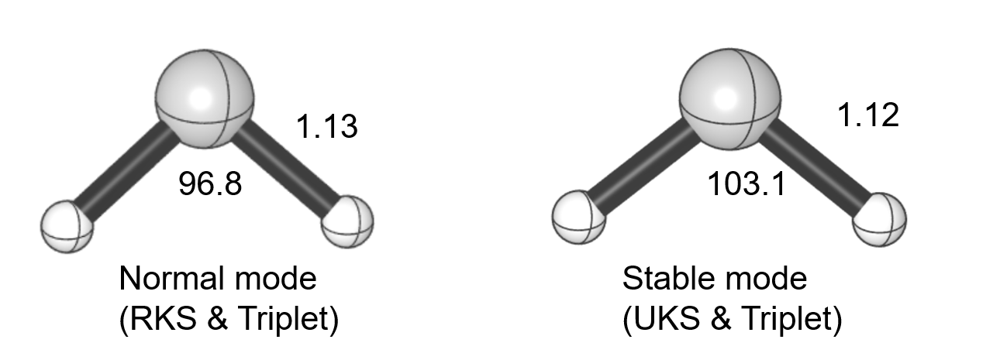
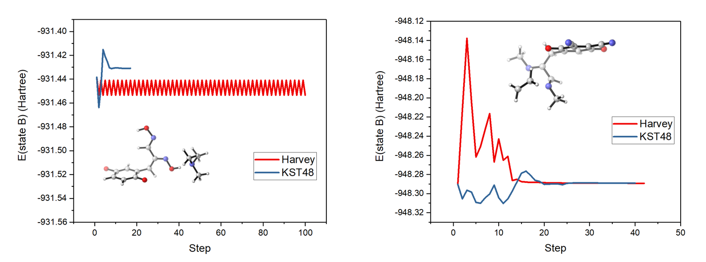
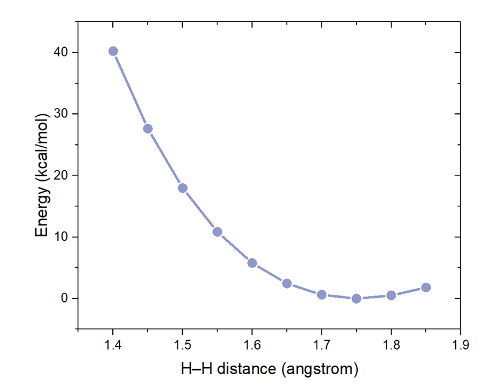

---
title: 'KST48: a Powerful Program for the Location of Minimum Energy Crossing Points (MECPs)'
tags:
  - Python
  - quantum chemistry
  - geometry optimization
authors:
  - name: Yumiao Ma^[corresponding author]
    orcid: 0000-0002-0628-8864
    affiliation: "1, 2" # (Multiple affiliations must be quoted)
affiliations:
 - name: BSJ Institute, Haidian, Beijing, 100084, People's Republic of China
   index: 1
 - name: Hangzhou Yanqu Information Technology Co., Ltd. Xixi Legu Creative Pioneering Park, No. 712 Wen’er West Road, Xihu District, Hangzhou City, Zhejiang Province, 310003, People’s Republic of China
   index: 2
date: 14 January 2022
bibliography: paper.bib

# Summary

The location of minimum energy crossing point (MECP) is highly important in the computational study of chemical reactions with possible spin state crossing. Despite the importance of MECP, the ability of MECP location and study is limited by the functionality of the most popular MECP location program, Harvey’s MECP program. KST48 provides a faster, more user-friendly and more controllable option for MECP location. In addition to the basic functionality which has been implemented before, KST48 also supports constrained optimization of MECP and potential energy scanning, and owns the interfaces to two of the most popular quantum chemical program, namely Gaussian and ORCA.
 
# Statement of need

When a chemical reaction occurs with possible change in electronic state, e.g. the change in spin state, or hopping from one excited state to the ground state, it is of interest how the electronic state change event happens, which is considered to be proceeded through a crossing point between the potential energy surfaces (PESs) corresponding to the two states. By applying the limit that the energies of the two states are identical, a geometrical space with 3N-7 dimensions is produced for a general molecule with N atoms, in which the geometry with locally lowest energy, namely MECP, is considered to be of special importance for the study of PES crossing.

Up till now, the location of MECP ([@bearpark1994direct]) almost relies the Fortran code by [@harvey1998singlet] in 1998, which requires multiple steps to set up, including the modification of source code and recompilation. Although some of the user interfaces, such as [@easyMECP] and [@sobMECP], were produced to wrap Harvey’s program and provides a more user-friendly package, the study on MECP still suffers from the limited functionality of Harvey’s original code. For example, only MECPs for ground states with different multiplicity can be located; no geometry constraints can be applied; the wave-function for the geometry optimization is hard to control, and the geometry convergence is slow. KST48 is, however, a purely Python-based program which does not depend on Harvey’s code, with higher convergence efficiency, and more functionality. By using KST48, the study on MECPs can be significantly accelerated.

# Functionality
1.	MECP location
MECP invokes with a quantum chemical program, either Gaussian or ORCA, according to the user input, and try to locate a MECP based on the energy and gradient obtained by this program. The geometry optimization of MECP in KST48 is based on the GDIIS algorithm ([-@farkas2002methods]). In the first three steps the geometry is propagated by the BFGS algorithm ([@broyden1970convergence]), and then the GDIIS iteration is entered, with the Hessian matrix updated by the Powell-symmetric-Broyden method ([@dennis1996numerical]). The convergence is generally faster than Harvey’s Fortran program. The maximum steps, maximum size of step and convergence threshold can be easily changed accordingly in the input file.
2.	Control of wave-function
In many cases, the stability of wave-functions should be ensured. There are four running mode in KST48, in order to enable the user to control the generating mode of wave-function:
2.1.	Normal: No special treatment.
2.2.	Stable: KST48 will automatically run a wave-function stability calculation of the initial geometry, and the so-generated wave-function will be read for the following optimization. 
2.3.	Read: If the user has already had the wave-function file, KST48 will read them and check the stability, and then do the optimization based on them in the “read” mode.
2.4.	Inter_read In some very hard cases, a wave-function may not be correct even though it is stable. For example, for some molecule, one can find a stable restricted wave-function for its singlet state, although there is an unrestricted wave-function significantly lower in energy, and only can be obtained byreading the high-spin wave-function. In the “inter_read” mode, the high-spin state B will firstly be calculated in the first step, and then low-spin state A reads its wave-function. Stability will be automatically checked. noread In normal mode, each step in the optimization reads the wave-function from the previous step. 
2.5.	Noread: No wavefunction is read, even during the iterative geometry optimization.
3.	Constrained optimization and potential energy scan
KST48 allows the user to apply geometry constraints to the molecule, in order to freeze one bond or angle. The constraints are achieved by a Lagrangian method. The potential energy surface scanning (1-D or 2-D) is also supported.
# Examples

# Acknowledgements

Yumiao Ma acknowledges Jianqing Qi (Tsinghua University) for polishing the coding style of KST48. Also acknowledgement to all the students in Department of Chemistry, Tsinghua Unviersity, for their great love and encouragement towards the author.

# References
